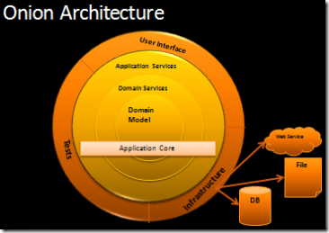

0# Architektúrák

Nagyon keverednek a fogalmak, átvettek egymástól fogalmakat, elnevezéseket,
valamint sajáttal bővítették. Hamar belekeveredtek a DDD fogalmak.

## Hexagonal (Ports and Adapters) architecture

(2005 - Alistair Cockburn)

- Nem kell hatszögnek lennie, csak így van elég hely
- Középen:
  - Core
  - Application
    - Minden külső kommunikációt egy port (interfész) definiál
      - Inbound port
      - Outbound port
- Portokat adapterek implementálják, melyek a külvilággal tartják a kapcsolatot

## Onion architecture

(2008 - Jeffrey Palermo)

Főbb célok:

- Középen az üzleti logika, ami független minden mástól
- Domain Model - entitások
- Domain Model - entitásoktól független, vagy entitásokon átnyúló üzleti szabályok
- Application Services - Use case-ek, interfészeken keresztül külső függőség
- További rétegek, melyek függősége csak befelé mutat
- Rétegek közötti kommunikáció interfészeken keresztül (Dependency Inversion)
- Keretrendszerek, adatbázis, ui, alkalmazásintegráció csak külső rétegben jelennek meg

## Clean Architecture

(2012 - Robert C. Martin (Uncle Bob))

- Robert C. Martin: Clean Architecture
- Objektumorientált alapelveket alkalmazza magasabb absztrakciós szinten (komponens)
  - Rendkívül erős oo alapok

### Architektúra fogalma

- Tervezési döntések
- Jellemzője, hogy mindig kevesebbet tudunk, mint amennyi a döntéshez szükséges lenne
- Megoldás: döntés elhalasztásának elve
- Ennek feltétele, ha a felkészülünk a változásra
- Architektúra célja: legkevesebb emberi erőforrásból elkészíteni és karbantartani a szoftvert
- Architekt: egy jó programozó, aki a programozási feladatain felül a csapatát a megfelelő tervezési döntésekkel a maximális hatékonyság felé tereli
- Új igény nem feltétlen illik bele az architektúrába: módosítást igényel
  - Egyik legerőforrásigényesebb, megtalálni a bővítési pontot

### OO alapelvek

- Egységbezárás, öröklődés, polimorfizmus
- S. O. L. I. D.

### Component principles

- REP - Reuse/release equivalence principle - újrafelhasználás és release tárgya ugyanaz
- CCP - Common closure principle - a komponens azokat az osztályokat gyűjtse össze, melyek azonos okból változhatnak
- CRP - Common reuse principle - komponens használóját ne kényszerítsük további felesleges függőségekre

### Komponensek közötti kapcsolatok

(Conway törvénye)

- ADP - Acyclic dependencies principle - ne legyen körkörös kapcsolat
- SDP - Stable Dependencies Principle - a dinamikusan változó komponensek függjenek a stabil komponenseken
- SAP - Stable Abstractions Principle - egy komponens annyira legyen absztrakt, mint amennyire stabil

### Folyamatában

- Kezdetben legyen egyben, de le lehessen módosítani
  - Package (struktúrális szinten külön, csomagolva egyben, futtatva egyben)
  - Maven modul (struktúrális szinten külön, csomagolva külön, futtatva egyben)
  - Microservice, SOA (struktúrális szinten külön, csomagolva külön, futtatva külön)

### Duplikálás

- Példa: két nagyon hasonló CRUD képernyő, különálló entitásokon
- Ami külön változik, külön legyen
- Ezen képernyőknek különböző lesz az életútja
- Duplikálás megengedhető
- Felesleges absztrakció közös részeket kiemelni
- Tilos pl. ugyanazt az entitást használni különböző rétegek között, különböző képernyőkön, in/out paraméterként
  - Ismétlés van
  - Másolást végző library-k

### Szoftver felosztása Clean Architecture szerint

- Policy: üzleti szabályok, az üzlet számára ez az érték
  - Funkcionális követelményekre válasz
  - Informatika nélkül is elvégeznék
  - Keretrendszer, DB és UI független
  - Önmagában tesztelhető
  - Két kör:
    - Entities (Domain Model)
      - Üzleti adatok
      - Kritikus üzleti szabályok egy részét reprezentálja
    - Use Cases (Application layer)
      - Input (request), lépések, output (response)
      - Üzleti folyamatok, aktorok és entitások interakciója
      - Definiálja az interfészeket, melyeket a külsőbb kör implementál
- Details: lehetővé teszik a szereplők számára az üzleti szabályokhoz való hozzáférést
  - Nem-funkcionális követelményekre válasz
  - IO, adatbázis, futtatókörnyezet, keretrendszer, kommunikációs protokollok
  - Device independence
  - Döntés elhalasztásának az elve
  - Csak ebben szerepelhetnek konfigurációk, fizikai elérések
  - Két kör:
    - Interface Adapters
    - Frameworks & Drivers (Infrastructure layer)
