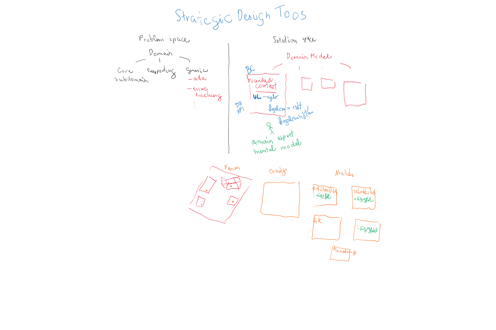
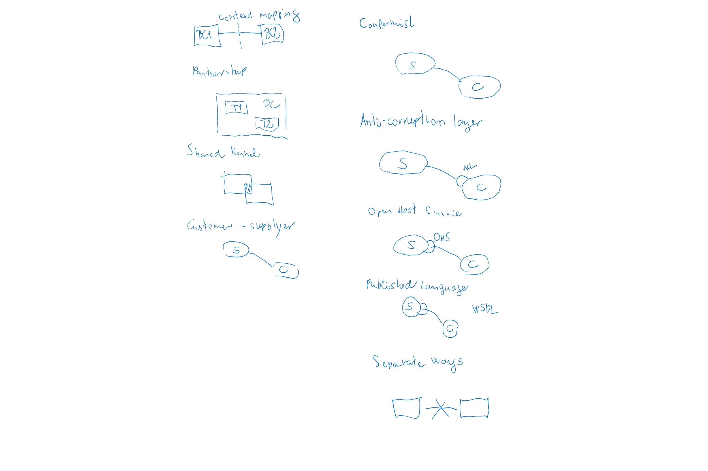
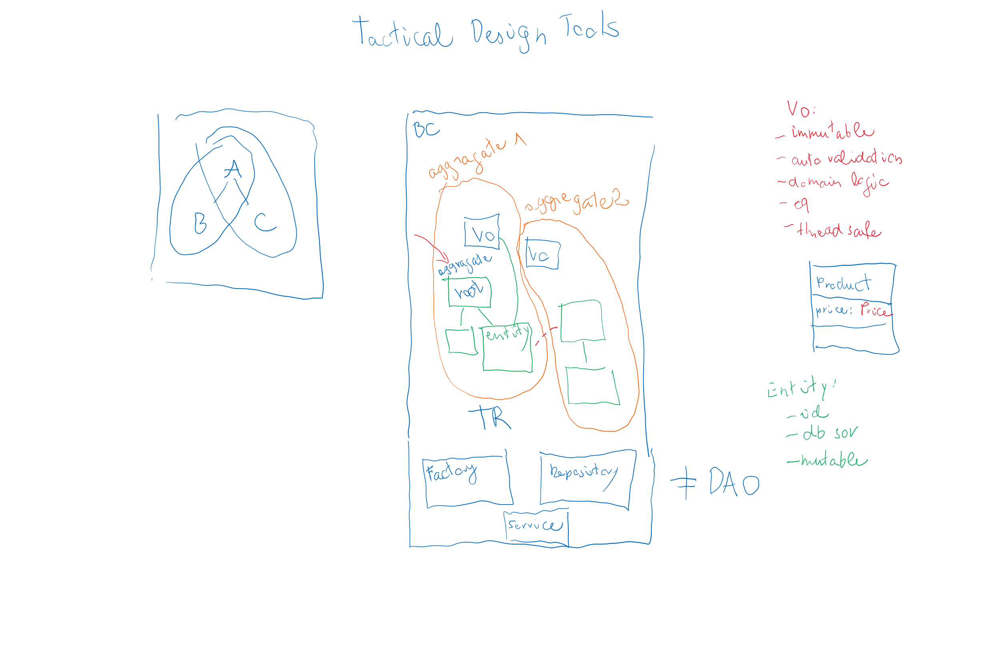

# DDD

(2003 - Eric Evans)

## Ajánlott irodalom

- Eric Evans: Domain-Driven Design: Tackling Complexity in the Heart of Software
- Vaughn Vernon: Domain-Driven Design Distilled
- Vaughn Vernon: Implementing Domain-Driven Design
- [Implementing Domain Driven Design with Spring by Maciej Walkowiak @ Spring I/O 2024](https://www.youtube.com/watch?v=VGhg6Tfxb60&t=606s)

## Példa projektek

- https://github.com/anton-liauchuk/educational-platform
- https://github.com/howiehu/ddd-architecture-samples
- https://github.com/mploed/ddd-with-spring
- https://github.com/banq/jivejdon
- https://github.com/ddd-by-examples/factory
- https://github.com/citerus/dddsample-core
- https://github.com/heynickc/awesome-ddd

## Bevezetés

- Mikor és hol vágjunk?
- Top-down
- Ne tervezzünk meg mindent előre az utolsó részletig, evolutionary design
- OOP fogalmak fontossága
- Modellezés, modellalkotás
- DDD: modellezési eszközök, minták
- A legtöbb architektúrával használható:
  - Van, amihez szorosan kapcsolódik: Onion, Hexagonal, Clean
  - Event driven architecture, CQRS, Reactive and actor model, REST, SOA, microservices, cloud
- Rossz felépítés gyakori okai:
  - Az üzlet úgy tekint a szoftverfejlesztésre, mint költségre, és nem úgy, mint lehetőség, mint stratégiai komponens
  - Fejlesztők túl technológia közeliek
  - Túl nagy a jelentősége az adatbázisnak, és adatmodellnek, szemben a folyamatokkal
  - Fejlesztőknek a névadás nyűg, nem következetesek
  - Gyakran abból adódik, hogy nem értik meg az üzleti problémát, nem jó az interakció az üzlettel
  - Alapos tervezés nélküli, feature-ök folyamatos szállítása, Big Ball of Mud
  - Rétegek nem válnak szét kellően
  - Nem optimalizált, nem hatékony adatbázis lekérdezések, melyek blokkolják a normál folyamatokat
  - YAGNI, rossz absztrakciók
  - Túl szoros kapcsolat a komponensek között
  - Anemic model

## Strategic Design Tools

- Kontextusok
- Problem space:
  - Domain, felosztható subdomains:
    - Core domain
    - Egyedi, versenyelőnyt biztosít a vállalatnak.
    - Gyakran a legbonyolultabb logika is ide kerül.
    - Pl. banki rendszerben a hitelezési kockázatkezelés
  - Supporting domains
    - Szükséges a core domain működéséhez, de önmagában nem ad különösebb üzleti értéket
    - Pl. banki rendszerben a dokumentumkezelés
  - Generic domains
    - Általános, ismétlődő problémák, amelyek szinte minden üzleti szoftverben előfordulnak
    - Tipikusan kész komponensekkel, könyvtárakkal, third-party megoldásokkal érdemes lefedni
    - Nem szabad házilag újra feltalálni, ha van megbízható standard
    - Pl. hitelesítés és jogosultságkezelés (Keycloak), időzítés, üzenetsorok, logging
- Solution space
  - Domain model (osztályok), Bounded context, Ubiquitous language (ugyanarra a fogalomra ugyanaz a szó)
    - Példa (client fogalma a sales, support, accounting és orders területen)
  - Domain expert: mental model
  - Context mapping: bounded contextek közötti kapcsolat
    - Együttműködésen alapuló
      - partnership: két csapat egy BC-n dolgozik
      - shared kernel: van egy közös rész, ami viszonylag stabil, a két csapat kölcsönösen birtokolja
    - Függőségi kapcsolatok
      - customer-supplier: customer kér, supplier valamikor valamit ad
      - conformist: customer maximálisan igazodik ahhoz, amit a supplier ad
    - Izolációs, védelmi kapcsolatok:
      - Anticorruption layer (ACL): saját BC-re átforgatás a customer-en belül
      - Separate ways: nincs integráció
    - Egyéb minták
      - Open host service (OHS): van egy jól használható API, amit bárki igénybe vehet
      - Published language: OHS-hez kapcsolódva, azt bővíti: XML séma, JSON séma, Protobuf, Avro
  - Saját db, saját API
  - Kommunikáció
    - SOAP
    - REST
    - Messaging
- Domain megértése
- Technológiamentes

## Tactical Design Tools

- Kontextuson belüli komponensek
- Implementációs részletek
- BC - microservice - country hasonlat
- Value objects (sohat BigDecimal, float for money): immutable, auto validation, domain logic, eq, thread safe
- Entity: id, value objects és más entitásokkal kapcsolat, sor az adatbázisban, mutable
- Aggregate
  - Túl bonyolult objektum gráf
  - Egy tranzakciónyi
  - Root entity - teljes életciklust vezérli
  - Mindig konzisztens állapotban van
- Factory
  - Ha túl bonyolult az aggregate létrehozása
- Repository
  - Abban különbözik a DAO-tól, hogy csak aggregate-enként van, nem entitásonként
  - Betölti a kapcsolatokat is

## Tervezés

- UML, diagrammok, user story-k hatékonysága kérdőjeles
- Event storming - brainstorming a domain model átadására
- Alberto Brandolini
- Fejlesztők, üzleti szakértők, tesztelők és más érintettek közösen, gyorsan és vizuálisan fedezik fel egy üzleti folyamat vagy domain működését.
- Hogy néz ki?
  - Kiindulás: nagy, üres, végtelen felület
  - Domain Eventekből indul ki, valami történt a rendszerben
  - Narancssárga cetlikkel ábrázolva
- Sorrendbe tenni
- Hozzákapcsolni
  - Kék cetli → Command (ami egy eseményt kivált).
  - Sárga cetli → Actor / User / System (ki indítja a folyamatot).
  - Rózsaszín cetli → Policy / üzleti szabály (pl. automatikus folyamatindítás).
  - Zöld cetli → Aggregátum vagy adat.
  - Szürke cetli → Külső rendszer.
- Határok meghúzása, BC-k azonosítása
- Fő célok
  - Gyors folyamat definíció
  - Közös nyelv
  - Rejtett tudás feltárása
  - Interfészek azonosítása
  - Félreértések tisztázása
- Több szinten alkalmazható
  - Big Picture Event Storming: magas szintű, a teljes üzleti folyamat feltérképezése.
  - Process Level Event Storming: részletesebben egy konkrét folyamatra.
  - Design Level Event Storming: technikai szinten, akár osztályok, entitások, aggregátumok szintjén.
- Előnyei
  - Interaktív és vizuális

## Egy megközelítés

[DDD, Hexagonal, Onion, Clean, CQRS, … How I put it all together](https://herbertograca.com/2017/11/16/explicit-architecture-01-ddd-hexagonal-onion-clean-cqrs-how-i-put-it-all-together/)
